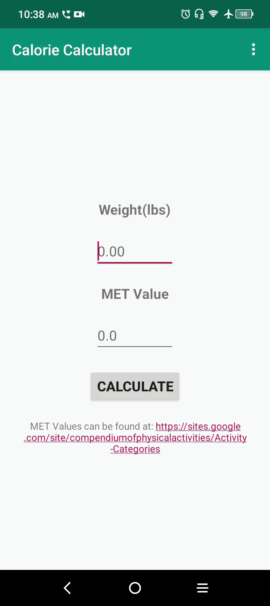
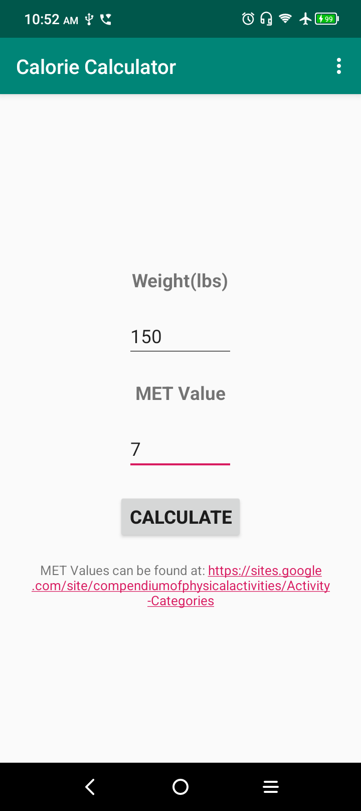

# Calorie Calculator
Calorie Calculator is an Android app that takes a MET value and the user's weight and outputs the calorie burn rate. 

MET values are used to measure the intensity of various physical activities. A list of MET values can be found at https://media.hypersites.com/clients/1235/filemanager/MHC/METs.pdf.

---

## Features
- Enter weight (lbs)
- Enter MET value for any activity
- Calculates calories burned per minute
- Simple, clean UI
- Works offline

---

## Tech Stack

- Language: Java
- UI: XML Layouts
- Build Tool: Gradle

---

## Demo

---

## Screenshots

---

## How to Install
### Note: App available for Android only

1. On your Android mobile device, go to http://www.bdtripp.com/#projects 
2. Find the Calorie Calculator project and tap the "Download Android App" button.
3. Open the file you just downloaded (app-release.apk)
4. If prompted with a security warning regarding "Unknown Sources" or "Unverified Developers":
   - Select **Settings** or **More Details**.
   - Enable the toggle for **Allow from this source** (or "Install anyway").
5. Return to the installation screen and tap "Install"
